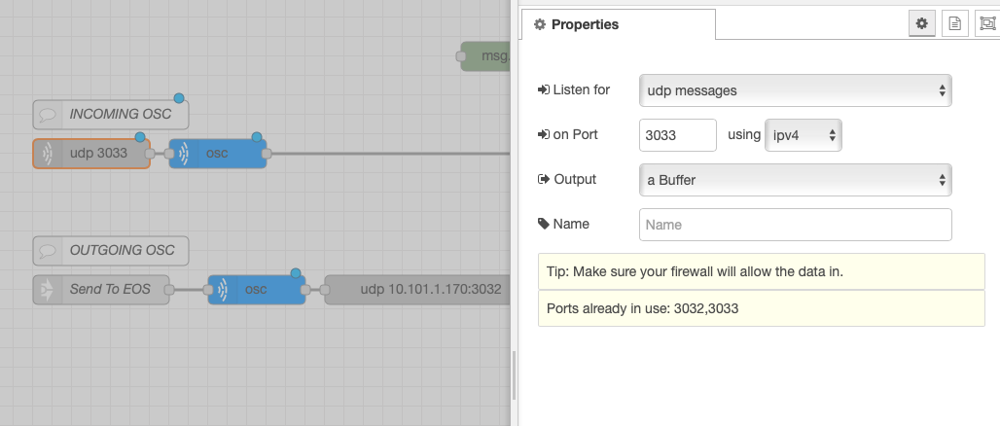
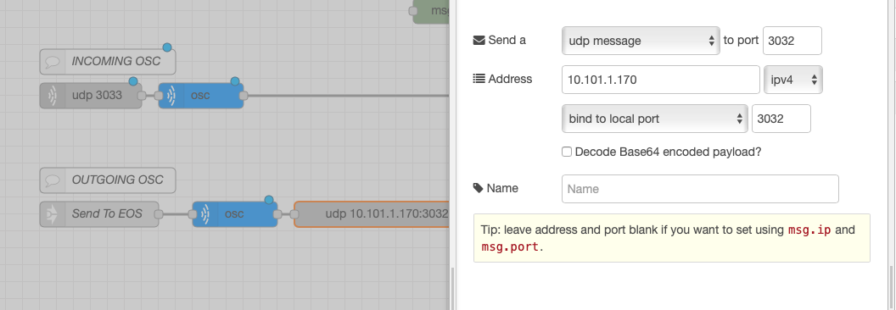

# HockEOS
Get realtime NHL stats pushed to EOS using OSC from NodeRed running on a separate machine.

This is in absolutely no way affiliated with ETC, and is certainly not endorsed by ETC.
Of course, I recommend that you NOT use this during a show.

!! THIS README IS NOT COMPLETE !!

<h1>About</h1>
This started off as a project for me to make a LAN based status board for NHL games. Then, Scott Tusing joked that I should make it also send the data to EOS. So, here we are.

<h2>What You Need</h2>

- Eos Family Console (or Nomad)

- Network between EOS/Nomad and:

- Computer running NodeRED (must have internet connection)
  - I use a Raspberry Pi, but it should work on any computer that can run NodeRED

<h2>Installation Instructions</h2>

Please follow these instructions, in this order, or else it won't work. You must install the two listed nodes below before trying to import HockEOS.

- Install NodeRED on your machine using the instructions found here:

    https://nodered.org/docs/getting-started/local

- Install node-red-contrib-osc Node:

    https://github.com/mikewoodld/node-red-contrib-osc

- Install node-red-contrib-moment Node:

    https://github.com/mikewoodld/node-red-contrib-moment

- Install node-red-contrib-interval Node:

    https://github.com/mikewoodld/node-red-contrib-interval

- Make sure computer running NodeRED has active internet connection.

- Make sure that EOS/Nomad and NodeRed computer can talk to each other on a network (Wired recommended)

- Import HockEOS Flow into NodeRED
  - Put link to flow .JSON file here

- Set up NodeRED OSC:
  - Double click on the grey UDP node under "Incoming OSC"
    - Set incoming UDP port (3033 default) - this will be your OUTGOING port on EOS.
      
  - Click Done

  - Double Click on the outgoing UDP node to the far right under "Outgoing OSC"
    - Set Address to the IPv4 address of your EOS/Nomad machine
    - Set "to port" to be the Rx port of your EOS/Nomad machine (default 3032)
      

  - Click DEPLOY to start the Flow
    - Note: anytime you click "deploy," you will need to send `/eos/set/push=true` again.

<h2>Eos Magic Sheet Setup</h2>

<h3>Subscribe to Team</h3>
  Tell HockEOS which team you want to see game data for:
    <pre>/nhl/get/team=XXX
        where xxx= 3-digit team code</pre>

HockEOS will reply with the next game for chosen team, if there is one, using the data outlined in the next section.

  Tells HockEOS how often to send you updates:
    <pre>/nhl/set/interval=YY
        where YY is a number of seconds as an integer (Default is 5, accepts 1 through 9999)</pre>
           HockEOS will reply with:
            <pre>/nhl/out/set/interval=ZZ
        where ZZ is the number of seconds you specified</pre>

 Start/Stop Live Updates:
    <pre>/nhl/set/push=true  (or false)
        </pre>
           HockEOS will reply with:     
             <pre>/nhl/out/set/push=true  (or false)
              </pre>

<h3>Things you can display</h3>

Click here for sample .esf with magic sheet

Right now I'm starting with a limited set of data. There's all kinds of data that the NHL API makes available  - you could easily reverse engineer what I've made here to add more data, or you can wait until I add more :)

<h4>Game Information</h4>
Start Date and Time of Next Game:

        /nhl/out/game/start/
            Example Return: "August 2nd, 2020 10:00PM"

Arena Name of Next Game:

        /nhl/out/arena/
            Example Return: "Amalie Arena"

Game Status:

        /nhl/out/game/status/
            Example Return: "In Progress"

Game Period:

        /nhl/out/game/period/
              Example Return: "1st Period"

Game Period Time Remaining:

        /nhl/out/game/period/time/remaining/
              Example Return: "04:20"
              Note: This does not count in realtime, it is the time remaining at the time the API call was made.

Game in Shootout

        /nhl/out/game/shootout/
              Example Return: "SHOOTOUT" or ""

Team Strength:

        /nhl/out/game/strength/
              Example Return: "4-on-4"

<h4>Team Information</h4>

Home Team Name:

        /nhl/out/home/team/
              Example Return: "Tampa Bay Lightning"

Away Team Name:

        /nhl/out/away/team/
              Example Return: "New York Rangers"

Home Team OnIce Count:

        /nhl/out/home/count/onice/
              Example Return: 5

Away Team OnIce Count:

        /nhl/out/away/count/onice/
              Example Return: 5

Power Play Status - Home Team:

        /nhl/out/home/powerplay/
              Example Return: "POWER PLAY" or "PENALTY KILL" or ""

Power Play Status - Away Team:

        /nhl/out/away/powerplay/
              Example Return: "POWER PLAY" or "PENALTY KILL" or "

Players On Ice - Home Team:

        /nhl/out/away/onice/
              Example Return: Carriage-return separated list of players on ice

Players On Ice - Away Team:

        /nhl/out/away/onice/
              Example Return: Carriage-return separated list of players on ice

Players in Penalty Box - Home Team:

        /nhl/out/away/inbox/
              Example Return: Carriage-return separated list of players in box

Players in Penalty Box - Away Team:

        /nhl/out/away/inbox/
              Example Return: Carriage-return separated list of players in box           

Empty Net - Home Team:

        /nhl/out/home/net/
              Example Return: "EMPTY NET" or ""

Empty Net - Away Team:

        /nhl/out/away/net/
              Example Return: "EMPTY NET" or ""

<h4>Score Information</h4>

Home Team Current Score:

        /nhl/out/home/score/
              Example Return: 6

Away Team Current Score:

        /nhl/out/away/score/
              Example Return: 0

Home Team Shots on Goal:

        /nhl/out/home/shots/
              Example Return: 10

Away Team Shots on Goal:

        /nhl/out/away/shots/
              Example Return: 20

Home Team Blocks:

        /nhl/out/home/blocks/
              Example Return: 20

Away Team Blocks:

        /nhl/out/away/blocks/
              Example Return: 14

Home Team Hits:

        /nhl/out/home/hits/
              Example Return: 35

Away Team Hits:

        /nhl/out/away/hits/
              Example Return: 1

Shootout - Home Team Attempts:

        /nhl/out/game/shootout/home/attempts/
              Example Return: "ATTEMPTS: 2"              

Shootout - Home Team Scores:

        /nhl/out/game/shootout/home/scores/
              Example Return: "SCORES: 0"

Shootout - Away Team Attempts:

        /nhl/out/game/shootout/away/attempts/
              Example Return: "ATTEMPTS: 2"

Shootout - Away Team Scores:

        /nhl/out/game/shootout/away/scores/
              Example Return: "SCORES: 0"

The shootout numbers include the leading text on purpose, so that you don't have to make extra text boxes in EOS (since you can't conditionally hide things in EOS)

<h4>Play Information</h4>

Last Event:

        /nhl/out/play/event/
              Example Return: "Stoppage"

Last Action:

        /nhl/out/play/action/
              Example Return: "Icing"

Detail:

        /nhl/out/play/detail/
              Example Return: "Stoppage - Icing"
              This basically just concatenates the earlier two objects into one.
