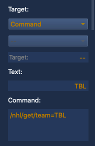

# HockEOS
Get realtime NHL stats pushed to EOS using OSC from NodeRed running on a separate machine.

!! THIS README IS NOT COMPLETE !!

<h1>About</h1>
This started off as a project for me to make a LAN based status board for NHL games. Then, Scott Tusing joked that I should make it also send the data to EOS. So, here we are.

<h2>What You Need</h2>
- Eos Family Console (or Nomad)
- Network
- Computer running NodeRED (must have internet connection)

<h2>Installation Instructions (COMING SOON)</h2>
- NodeRED Instructions Go Here
- Need OSC and MOMENT modules for NodeRED - Details here.
- Network Requirements Go Here
- EOS Network Settings Go Here

<h2>Eos Magic Sheet Setup</h2>

<h3>Subscribe to Team</h3>
  Tell HockEOS which team you want to see game data for:
    <pre>/nhl/get/team=XXX
        where xxx= 3-digit team code</pre>

<

  Tells HockEOS how often to send you updates:
    <pre>/nhl/set/interval=YY
        where YY is a number of seconds</pre>

<h3>Things you can display</h3>

<h4>Game Information</h4>
Start Date and Time of Next Game:

        /nhl/out/game/start/
            Example Return: "August 2nd, 2020 10:00PM"

Arena Name of Next Game:

        /nhl/out/arena/
            Example Return: "Amalie Arena"

Game Status:

        /nhl/out/game/status/
            Example Return: "In Progress"

Game Period:

        /nhl/out/game/period/
              Example Return: "1st Period"

Game Period Time Remaining:

        /nhl/out/game/period/time/remaining/
              Example Return: "04:20"
              Note: This does not count in realtime, it is the time remaining at the time the API call was made.

Team Strength:

        /nhl/out/game/strength/
              Example Return: "4-on-4"

<h4>Team Information</h4>

Home Team Name:

        /nhl/out/home/team/
              Example Return: "Tampa Bay Lightning"

Away Team Name:

        /nhl/out/away/team/
              Example Return: "New York Rangers"

Home Team OnIce Count:

        /nhl/out/home/count/onice/
              Example Return: 5

Away Team OnIce Count:

        /nhl/out/away/count/onice/
              Example Return: 5

Power Play Status - Home Team:

        /nhl/out/home/powerplay/
              Example Return: "POWER PLAY" or "PENALTY KILL" or ""

Power Play Status - Away Team:

        /nhl/out/away/powerplay/
              Example Return: "POWER PLAY" or "PENALTY KILL" or ""              

<h4>Score Information</h4>

Home Team Current Score:

        /nhl/out/home/score/
              Example Return: 6

Away Team Current Score:

        /nhl/out/away/score/
              Example Return: 0

Home Team Shots on Goal:

        /nhl/out/home/shots/
              Example Return: 10

Away Team Shots on Goal:

        /nhl/out/away/shots/
              Example Return: 20

<h4>Play Information</h4>

Last Event:

        /nhl/out/play/event/
              Example Return: "Stoppage"

Last Action:   

        /nhl/out/play/action/
              Example Return: "Icing"

Detail:

        /nhl/out/play/detail/
              Example Return: "Stoppage - Icing"
              This basically just concatenates the earlier two objects into one.
